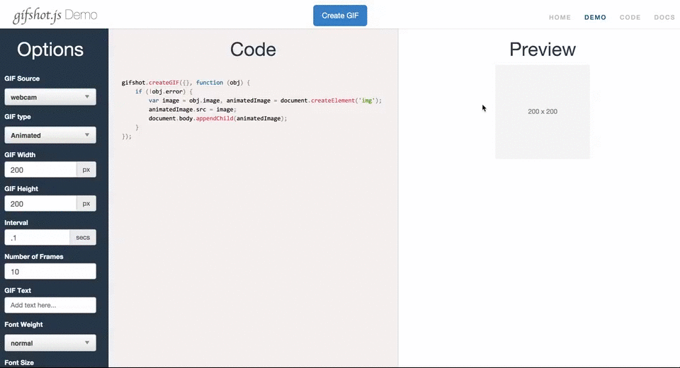

=======

JavaScript library that can create animated GIFs from media streams, videos, or images


## How

gifshot uses the following technologies:

- The webRTC `getUserMedia()` API to get permission to use a user's webcam and manipulate the `CameraStream` Media object

- The HTML5 `Filesystem` APIs to handle the temporary blob URL creation

- The HTML5 `video` element to stream the blob URL

- The `canvas` API to create a dynamic image from an HTML5 video, or images

- `Web workers` to process the GIF frames

- `Typed Arrays` to handle binary image data

- `Base 64 encoding` to create a base 64 encoded image string


## Browser Support

 - **Animated GIF from Webcam** :

 * Firefox 17+, Chrome 21+, Opera 18+, Blackberry Browser 10+, Opera Mobile 12+, Chrome For Android 35+, Firefox for Android 29+

 - **Animated GIF from Existing Video** :

 * All modern browsers (IE10+)

 - **Animated GIF from Existing Images** :

 * All modern browsers (IE10+)


## Quick Start
*  Include `gifshot` on your HTML page (`gifshot.js` can be found in the `build` directory)

```html
<script src='gifshot.js'></script>
```

*  Start using the JavaScript API to create your animated GIFs

```javascript
// By default, a user's webcam is used to create the animated GIF
gifshot.createGIF({}, function(obj) {
	if(!obj.error) {
		var image = obj.image,
		animatedImage = document.createElement('img');
		animatedImage.src = image;
		document.body.appendChild(animatedImage);
	}
});
```

## Demo Set Up

1.  git clone this repo: `git clone git@github.com:yahoo/gifshot.git`
2.  Install [Node.js](http://nodejs.org/)
3.  Install all local dependencies: `npm install`
4.  Start up the included node.js preview server: `npm run preview`
5.  Go to `localhost:8001` to try out gifshot




## API Methods

### createGIF(options, callback)

Creates an animated GIF from either a webcam stream, an existing video (e.g. mp4), or existing images

**Note:** If you wish to use the default options, you can just pass a callback function as the only argument

**Another Note:** An object is passed back to the callback function with helpful data

```javascript
gifshot.createGIF({}, function(obj) {
	// callback object properties
	// --------------------------
	// image - Base 64 image
	// cameraStream - The webRTC MediaStream object
	// error - Boolean that determines if an error occurred
	// errorCode - Helpful error label
	// errorMsg - Helpful error message
	// savedRenderingContexts - An array of canvas image data (will only be set if the saveRenderingContexts option was used)
});
```

### takeSnapShot(options, callback)

Takes a snap shot (not animated) image from a webcam stream or existing video

**Note:** If you wish to use the default options, you can just pass a callback function as the only argument

**Another Note:** An object is passed back to the callback function with helpful data

```javascript
gifshot.takeSnapShot({}, function(obj) {
	// callback object properties
	// --------------------------
	// image - Base 64 image
	// error - Boolean that determines if an error occurred
	// errorCode - Helpful error label
	// errorMsg - Helpful error message
	// savedRenderingContexts - An array of canvas image data (will only be set if the saveRenderingContexts option was used)
});
```

### stopVideoStreaming()

Turns off the user's webcam (by default, the user's webcam is turned off)

**Note:** This is helpful when you use the `keepCameraOn` option

```javascript
gifshot.stopVideoStreaming();
```

### isSupported()

If the current browser supports all of the gifshot animated GIF options

```javascript
gifshot.isSupported();
```

### isWebCamGIFSupported()

If the current browser supports creating animated GIFs from a webcam video stream

```javascript
gifshot.isWebCamGIFSupported();
```

### isExistingVideoGIFSupported()

If the current browser supports creating animated GIFs from an existing HTML video (e.g. mp4, ogg, ogv, webm)

**Note:** You can pass in an array of codec extensions to specifically check if the current browser supports at least one of them

```javascript
gifshot.isExistingVideoGIFSupported(['mp4', 'ogg']);
```

### isExistingImagesGIFSupported()

If the current browser supports creating animated GIFs from existing images (e.g. jpeg, png, gif)

```javascript
gifshot.isExistingImagesGIFSupported();
```

## Examples

**Web Cam**

```javascript
gifshot.createGIF(function(obj) {
	if(!obj.error) {
		var image = obj.image,
		animatedImage = document.createElement('img');
		animatedImage.src = image;
		document.body.appendChild(animatedImage);
	}
});
```

**HTML5 Video**

```javascript
gifshot.createGIF({
	'video': ['example.mp4', 'example.ogv']
},function(obj) {
	if(!obj.error) {
		var image = obj.image,
		animatedImage = document.createElement('img');
		animatedImage.src = image;
		document.body.appendChild(animatedImage);
	}
});
```

**Images**

```javascript
gifshot.createGIF({
	'images': ['http://i.imgur.com/2OO33vX.jpg', 'http://i.imgur.com/qOwVaSN.png', 'http://i.imgur.com/Vo5mFZJ.gif']
},function(obj) {
	if(!obj.error) {
		var image = obj.image,
		animatedImage = document.createElement('img');
		animatedImage.src = image;
		document.body.appendChild(animatedImage);
	}
});
```

**Snap Shot**

```javascript
gifshot.takeSnapShot(function(obj) {
	if(!obj.error) {
		var image = obj.image,
		animatedImage = document.createElement('img');
		animatedImage.src = image;
		document.body.appendChild(animatedImage);
	}
});
```

## Options

```javascript
// Desired width of the image
'gifWidth': 200,
// Desired height of the image
'gifHeight': 200,
// If this option is used, then a GIF will be created using these images
// e.g. ['http://i.imgur.com/2OO33vX.jpg', 'http://i.imgur.com/qOwVaSN.png', 'http://i.imgur.com/Vo5mFZJ.gif'],
// Note: Make sure these image resources are CORS enabled to prevent any cross-origin JavaScript errors
// Note: You may also pass a NodeList of existing image elements on the page
'images': [],
// If this option is used, then a gif will be created using the appropriate video
// HTML5 video that you would like to create your animated GIF from
// Note: Browser support for certain video codecs is checked, and the appropriate video is selected
// Note: You may also pass a NodeList of existing video elements on the page
// e.g. 'video': ['example.mp4', 'example.ogv'],
'video': null,
// You can pass an existing video element to use for the webcam GIF creation process,
// and this video element will not be hidden (useful when used with the keepCameraOn option)
// Pro tip: Set the height and width of the video element to the same values as your future GIF
// Another Pro Tip: If you use this option, the video will not be paused, the object url not revoked, and
// the video will not be removed from the DOM.  You will need to handle this yourself.
'webcamVideoElement': null,
// Whether or not you would like the user's camera to stay on after the GIF is created
// Note: The cameraStream Media object is passed back to you in the createGIF() callback function
'keepCameraOn': false,
// Expects a cameraStream Media object
// Note: Passing an existing camera stream will allow you to create another GIF and/or snapshot without
//	asking for the user's permission to access the camera again if you are not using SSL
'cameraStream': null,
// The amount of time (in seconds) to wait between each frame capture
'interval': 0.1,
// The number of frames to use to create the animated GIF
// Note: Each frame is captured every 100 milleseconds of a video and every ms for existing images
'numFrames': 10,
// The text that covers the animated GIF
'text': '',
// The font weight of the text that covers the animated GIF
'fontWeight': 'normal',
// The font size of the text that covers the animated GIF
'fontSize': '16px',
// The minimum font size of the text that covers the animated GIF
// Note: This option is only applied if the text being applied is cut off
'minFontSize': '10px',
// Whether or not the animated GIF text will be resized to fit within the GIF container
'resizeFont': false,
// The font family of the text that covers the animated GIF
'fontFamily': 'sans-serif',
// The font color of the text that covers the animated GIF
'fontColor': '#ffffff',
// The horizontal text alignment of the text that covers the animated GIF
'textAlign': 'center',
// The vertical text alignment of the text that covers the animated GIF
'textBaseline': 'bottom',
// The X (horizontal) Coordinate of the text that covers the animated GIF (only use this if the default textAlign and textBaseline options don't work for you)
'textXCoordinate': null,
// The Y (vertical) Coordinate of the text that covers the animated GIF (only use this if the default textAlign and textBaseline options don't work for you)
'textYCoordinate': null,
// Callback function that provides the current progress of the current image
'progressCallback': function(captureProgress) {},
// Callback function that is called when the current image is completed
'completeCallback': function() {},
// how many pixels to skip when creating the palette. Default is 10. Less is better, but slower.
// Note: By adjusting the sample interval, you can either produce extremely high-quality images slowly, or produce good images in reasonable times.
// With a sampleInterval of 1, the entire image is used in the learning phase, while with an interval of 10,
// a pseudo-random subset of 1/10 of the pixels are used in the learning phase. A sampling factor of 10 gives a
// substantial speed-up, with a small quality penalty.
'sampleInterval': 10,
// how many web workers to use to process the animated GIF frames. Default is 2.
'numWorkers': 2,
// Whether or not you would like to save all of the canvas image binary data from your created GIF
// Note: This is particularly useful for when you want to re-use a GIF to add text to later
'saveRenderingContexts': false,
// Expects an array of canvas image data
// Note: If you set the saveRenderingContexts option to true, then you get the savedRenderingContexts
//	in the createGIF callback function
'savedRenderingContexts': []
// The cross origin value. The default value is almost certainly what you need.
'crossOrigin': 'Anonymous'
```


## Custom Builds

We provide a **gulp** `custom-build` task, that allows you to remove certain dependencies that you may not need.  Pass in the custom build name that you would like (it default to `webcam`):

`gulp custom-build --webcam`


**Note:** For custom builds, you need to clone this repo locally.  Also, the unminified and minified custom build files will be in the `build/custom` directory of the local gifshot repo.


###Possible build options:

`webcam` - The webcam-to-GIF functionality of gifshot (the existing image/video logic is removed)

`image` - The image-to-GIF functionality of gifshot (the existing webcam/video logic is removed)

`video` - The HTML5 video-to-GIF functionality of gifshot (the existing webcam/image logic is removed)


## Contributing

Please send all PR's to the `dev` branch.

If your PR is a code change:

1.  Install all node.js dev dependencies: `npm install`
2.  Update the appropriate module inside of the `src/modules` directory.
3.  Install gulp.js globally: `sudo npm install gulp -g`
4.  Concatenate, Lint, Test, and Minify gifshot with Gulp: `gulp`
5.  Verify that the minified output file has been updated in `build/gifshot.js` and `build/gifshot.min.js` and that no unit tests are failing.
6.  Send the PR!

**Note:** There is a gulp `watch` task set up that will automatically build, test, and minify gifshot whenever a module inside of the `src/modules` directory is changed.  We recommend using it.


## Credits

gifshot would not have been possible without the help/inspiration of the following libraries/awesome people:

###Used

- [NeuQuant](http://members.ozemail.com.au/~dekker/NEUQUANT.HTML)
 * An image quantization algorithm to reduce the number of colors required to represent the image (thus decreasing the file size). This script was ported from C into Java by Kevin Weiner and then to [ActionScript 3](http://www.bytearray.org/?p=93) by Thibault Imbert, and to [JavaScript](http://antimatter15.com/wp/2010/07/javascript-to-animated-gif/) by antimatter15, and fixed, patched and revised by [sole](http://soledadpenades.com).
 * Copyright (c) Anthony Dekker 1994 - [MIT License](http://members.ozemail.com.au/~dekker/NEUQUANT.C)


- [Dean McNamee](https://github.com/deanm)'s [omggif](https://github.com/deanm/omggif)
 * Encodes a GIF into the GIF89 spec
 * Copyright (c) Dean McNamee, 2013 - [MIT License](https://github.com/deanm/omggif)


###Inspiration

- [Soledad Penadés](https://github.com/sole)'s [gumhelper.js](https://github.com/sole/gumhelper)
 * A module wrapping WebRTC's getUserMedia

- [Soledad Penadés](https://github.com/sole)'s [animated_GIF.js](https://github.com/sole/Animated_GIF)
 * Uses web workers and encoding/decoding algorithms to produce a Base 64 data URI image

- [Jen Fong-Adwent](https://github.com/ednapiranha)'s (aka Edna Piranha) [Meatspace Chat](https://chat.meatspac.es/)

## Contributors

#### [Chase West](https://github.com/ChaseWest)


#### [Greg Franko](https://github.com/gfranko)


#### [Chris Chernoff](https://github.com/chrischernoff)

